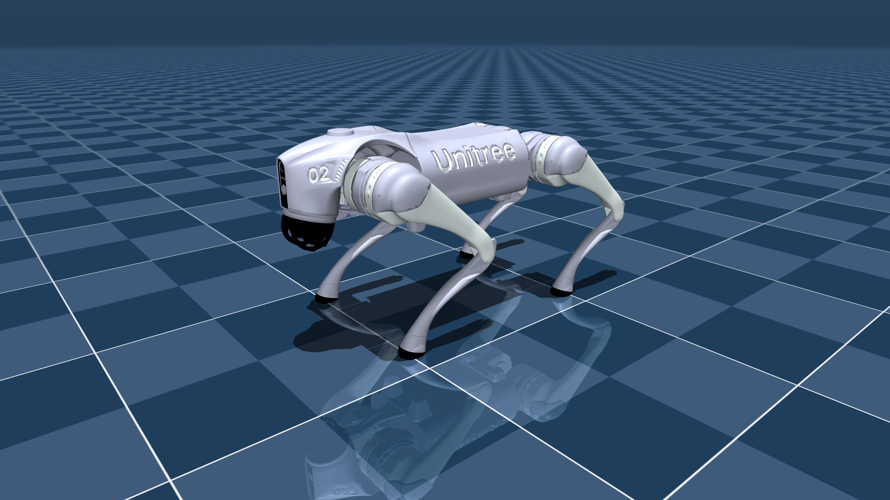

# mujoco-js

Um viewer de robôs MuJoCo rodando 100% no navegador, com renderização em Three.js e
uma **policy de locomoção por reforço (RL) executada via ONNX**. O robô simulado por
padrão é o **Unitree Go2**, que anda de verdade quando você o comanda pelo teclado.

Tudo roda no cliente: a física é o [MuJoCo](https://mujoco.org) compilado para
WebAssembly, o render é Three.js/WebGL, e a rede neural é uma policy exportada para
ONNX executada com `onnxruntime-web`.

## Demo



> A policy carregada foi treinada com [mjlab](https://github.com/mujocolab/mjlab)
> (`rsl_rl`) e exportada para ONNX com normalizador embutido.

## Controles

| Tecla | Ação |
|-------|------|
| `W` / `S` | andar para frente / trás |
| `A` / `D` | andar lateralmente |
| `Q` / `E` | girar (yaw) |
| `R` | resetar a simulação |

Mouse: arraste para orbitar, scroll para zoom, botão direito para pan.

## Stack

- **[MuJoCo](https://mujoco.org) via [`@mujoco/mujoco`](https://www.npmjs.com/package/@mujoco/mujoco)** — física compilada para WebAssembly, carrega XML + assets por um VFS em memória.
- **[Three.js](https://threejs.org)** — renderização WebGL da cena.
- **[onnxruntime-web](https://onnxruntime.ai)** — inferência da policy RL (build wasm, single-thread).
- **[Vite](https://vite.dev)** + **[Bun](https://bun.com)** — dev server e bundling.

## Como rodar

```bash
bun install
bun run dev        # servidor de desenvolvimento (http://localhost:5173)
```

Outros scripts:

```bash
bun run build      # build de produção em dist/
bun run preview    # serve o build de produção
```

## Como funciona

O projeto evita mapear cada peça do robô à mão: a cena é **construída a partir do
`MjModel` compilado** e sincronizada com o `MjData` a cada frame. Isso faz o viewer
ser genérico — o mesmo código renderiza qualquer modelo do menagerie.

### 1. Carregamento (`main.js`)

- [`loadModel()`](main.js:51) baixa o XML e registra os assets (`.obj`, texturas) num
  `MjVFS`, depois chama `MjModel.from_xml_string(xml, vfs)`. O `<include>` do
  `scene.xml` e o `meshdir="assets"` são resolvidos pelo VFS.
- [`meshGeometryFromModel()`](main.js:97) monta a `BufferGeometry` direto de
  `mesh_vert` / `mesh_face` — sem reparsear OBJ no JS.
- [`buildSceneFromModel()`](main.js:181) cria um `THREE.Group` por body e ignora os
  geoms de colisão (grupo 3), renderizando só os visuais (grupo 2).
- [`syncBodies()`](main.js:238) copia `data.xpos` / `data.xquat` para os grupos a cada
  frame. A cena fica em **Z-up**, igual ao MuJoCo.

### 2. Policy RL (`policy.js`)

[`PolicyController`](policy.js:16) monta o vetor de observação, roda a rede e traduz
a saída em comandos de atuador:

- [`buildObs()`](policy.js:193) constrói as 45 observações do estado do MuJoCo.
- [`apply()`](policy.js:272) aplica a ação. Com `controlMode: "position"` (padrão)
  calcula o torque por um **PD**: `u = kp·(target − q) − kd·q̇`, com clamp em
  `actuator_ctrlrange`. Com `controlMode: "torque"` a ação escala direto para o atuador.
- [`tick()`](policy.js:300) roda a inferência de forma assíncrona (latência de 1 tick,
  sem travar o render loop).

O loop em [`animate()`](main.js:452) roda a física em tempo real com um acumulador e
decima o controle conforme `controlHz` (ex.: física a 500 Hz, controle a 50 Hz → 10
passos de física por passo de policy).

### 3. Layout das observações

O normalizador embutido no ONNX revelou o layout (45 dims), que é o padrão
`legged_gym` / `rsl_rl`:

| Segmento | Dims | Conteúdo | Escala |
|----------|------|----------|--------|
| `angVel` | 3 | velocidade angular do tronco (frame do corpo) | 0.25 |
| `gravity` | 3 | gravidade projetada no frame do corpo (≈ `Rᵀ·(0,0,−1)`) | 1.0 |
| `command` | 3 | `[vx, vy, yaw]` alvo | 1.0 |
| `dofPos` | 12 | `q − defaultJointAngles` | 1.0 |
| `dofVel` | 12 | velocidade das juntas | 0.05 |
| `actions` | 12 | ação do passo anterior | 1.0 |

Ação → atuador: `ctrl[i] = defaultJointAngles[i] + action[i] * actionScale`, com
`actionScale = 0.25`.

## Configurando a policy

Tudo fica em [`public/models/unitree_go2/policy.json`](public/models/unitree_go2/policy.json):

```jsonc
{
  "model": "policy.onnx",
  "controlHz": 50,            // frequência do controlador
  "controlMode": "position",  // "position" (PD) ou "torque"
  "actionScale": 0.25,
  "jointOrder": ["FL_hip_joint", "..."],   // ordem que a policy espera
  "defaultJointAngles": { "...": 0.0 },
  "jointGains": { "FL_calf_joint": { "kp": 40, "kd": 1.0 } },
  "obsOrder": ["angVel", "gravity", "command", "dofPos", "dofVel", "actions"],
  "obsScales": { "angVel": 0.25, "dofVel": 0.05 },
  "commandScales": { "linVel": 1.0, "angVel": 1.0 }
}
```

Como o modelo é tratado como caixa-preta, trocar de checkpoint normalmente é só
editar esse arquivo — sem tocar no código. A ordem dos atuadores no XML não importa:
o controlador resolve o atuador a partir do **nome da junta**.

### Requisitos do `.onnx`

- Entrada `obs` `[1, 45]` (float32), saída `actions` `[1, 12]`.
- Se o modelo foi exportado com **pesos externos** (padrão do mjlab/rsl_rl), o arquivo
  `policy.onnx.data` precisa estar ao lado do `policy.onnx`. O viewer o carrega e passa
  via `InferenceSession.create(..., { externalData })`.

## Estrutura

```
main.js                 # viewer MuJoCo -> Three.js + loop de controle
policy.js               # PolicyController (obs, ONNX, action -> ctrl)
vite.config.js          # config do Vite (otimização do ORT)
index.html              # UI (painel de status + controles)
public/models/
  unitree_go2/          # Unitree Go2 + policy.onnx + policy.json
  unitree_a1/           # Unitree A1 (alternativo, mesmo pipeline)
assets/                 # CAD do micro servo SG90 (SolidWorks)
```

## Trocar de robô

O renderer é genérico. Para usar outro modelo do
[mujoco_menagerie](https://github.com/google-deepmind/mujoco_menagerie), copie os
assets para `public/models/<robo>/` e ajuste as constantes em
[`main.js`](main.js:71):

```js
const MODEL_BASE = '/models/unitree_go2/';
const MODEL_XML = 'scene.xml';
const MODEL_ASSETS = ['go2.xml', 'assets/base_0.obj', /* ... */];
```

O `Unitree A1` já vem incluído como alternativa. Se a policy não carregar, o viewer
continua funcionando na pose `home`.

## Créditos

- Modelos: [mujoco_menagerie](https://github.com/google-deepmind/mujoco_menagerie) (Google DeepMind).
- Policy: treinada com [mjlab](https://github.com/mujocolab/mjlab) (`rsl_rl`).
- Física: [MuJoCo](https://mujoco.org) / [@mujoco/mujoco](https://www.npmjs.com/package/@mujoco/mujoco).
- Inferência: [ONNX Runtime Web](https://onnxruntime.ai).

## Notas

- A pasta `mujoco_menagerie-main/` (fontes completas, ~1.8 GB) **não** é versionada —
  só os modelos usados em runtime ficam em `public/models/`.
- O `vite.config.js` exclui `onnxruntime-web` do pré-bundle: o ORT resolve o `.wasm`
  via `new URL(..., import.meta.url)` e o pré-bundle quebraria isso em dev.
